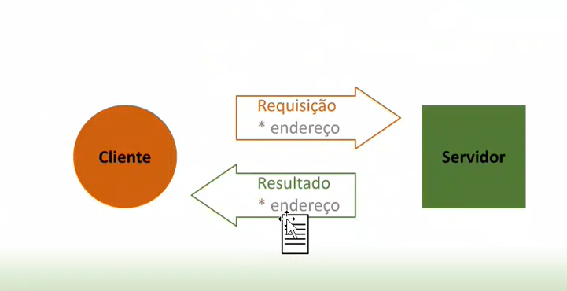
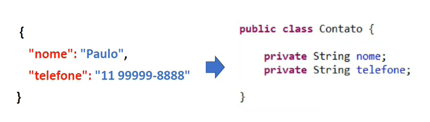
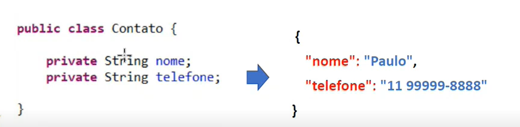
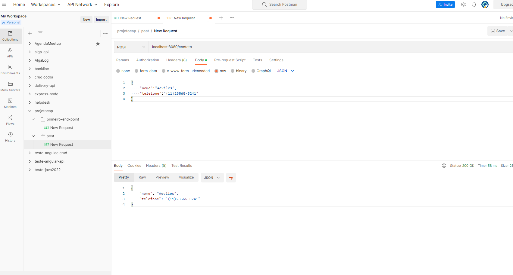
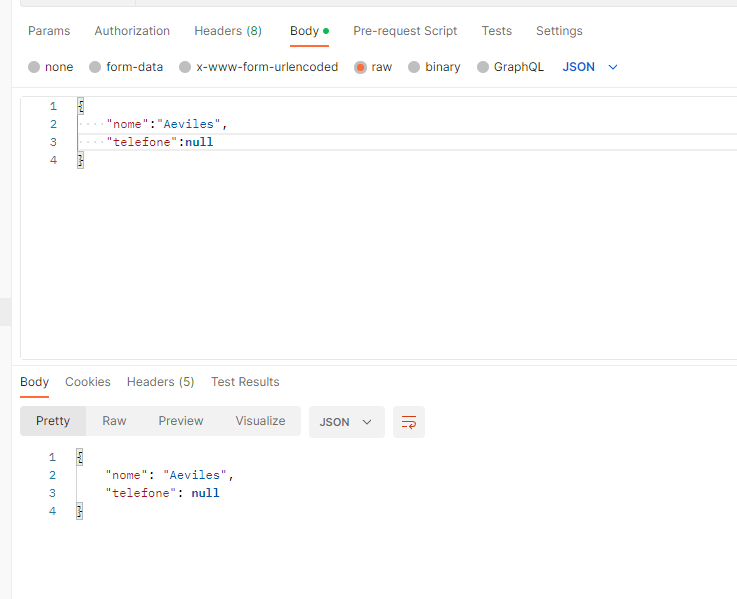
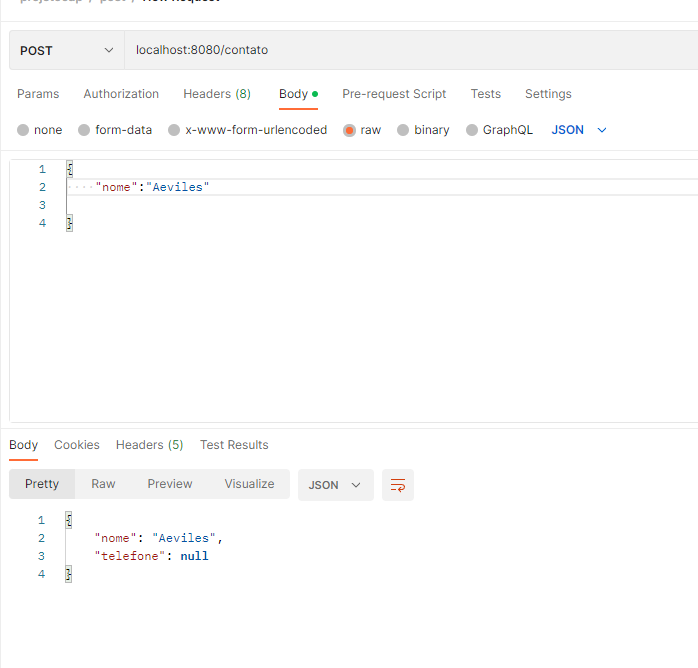

# intensivaoSpringBoot

- Arquitetura Client Servidor

## End point

Endpoint é o caminho de um recurso.

http://localhost:8080
http://localhost:8080/contato
http://google.com

- localhost: é a máquina
- 8080: é o servidor rodando dentro da máquina
- se tiver algo mais como / contato é o que eu quero dentro do servidor

## Parametros

Dados contidos no end poitn

Query Parâmetros:
http://localhost:8080/contato?nome=Aeviles

Path Parâmetros (O PARAMETRO VAI DIRETO NA URL)
http://localhost:8080/contato/Aeviles

Não existe sobrecarga de endpoint, endpoint só pode ter um .

O que é cachear? ele guarda no cache do navegador uma resposta

Essa forma abaixo é menos utilizada devido o cacheamento

//http://localhost:8080/subtracao?a=1&b=2
@GetMapping("subtracao")
public Integer subtracao(@RequestParam (value = "a", required = false) Integer a, @RequestParam(value = "b", required = false) Integer b){

        System.out.println("a="+a);
        System.out.println("b="+b);
        System.out.println();
        if(b==null){
            return a;
        }else if(a==null){
            return b;
        }
        else {

            return a - b;
        }
    }

A forma mais utilizada é através do pathVariable, evita o cacheamento

//http://localhost:8080/path/multiplicacao/a/5/b/6
@GetMapping("/path/multiplicacao/a/{a}/b/{b}")
public Integer multiplicacao(@PathVariable("a") Integer a, @PathVariable("b") Integer b){

        System.out.println("a="+a);
        System.out.println("b="+b);
        System.out.println();
        if(b==null){
            return a;
        }else if(a==null){
            return b;
        }
        else {

            return a * b;
        }
    }

## Java Beans

é uma especificação do java que permite a criação de uma instancia de um objeto dentro do Container(Tomcat);

Convenções utilizadas nos JavaBeans

Para ser considerada como um JavaBean, uma classe precisa seguir algumas convenções de nomenclatura de métodos, 
construtores e comportamento. Estas convenções permitem a existência de ferramentas que podem utilizar e manipular 
os JavaBeans.

As convenções definem que a classe:

- implemente a interface java.io.Serializable (que possibilita a persistência e restauração do estado do objeto da classe);
- possua um construtor sem argumentos;
- que as suas propriedades sejam acessíveis através de métodos "get" e "set", seguindo um padrão de nomenclatura;
- possa conter qualquer método de tratamento de eventos.
- Como estes requisitos são expressos em convenções ao invés de serem garantidos através de uma interface, alguns 
programadores vêem os JavaBeans como Plain Old Java Objects que seguem certas convenções de nomenclatura. 
Porém, esta visão é enganosa para JavaBeans que suportam tratamento de eventos, já que as convenções de nomenclatura 
neste caso são mais complexas e pedem a utilização de classes como base e a implementação de interfaces. 
O java beans é bastante usado por programadores em jsp ou seja (Java Server Page) onde através deles implementam 
construtores de classes e métodos.

Vantagens da utilização dos JavaBeans
- As propriedades,eventos e métodos de um bean que são expostas a outra aplicação podem ser controladas.
- Um bean pode registrar e receber eventos vindos de outros objetos e gerar eventos que serão enviados a 
esses outros objetos.
- Java Beans podem ser configurados com a ajuda de softwares auxiliares.
- As configurações de um bean podem ser salvas em algum meio de armazenamento persistente.
 
Desvantagens da utilização dos JavaBeans:

-  Uma classe com um construtor nulo pode ser instanciada contendo um estado inválido. Se tal classe for instanciada 
manualmente pelo desenvolvedor(ao invés de automaticamente por algum tipo de framework), o desenvolvedor pode não
perceber que essa classe foi instanciada de forma impropria. O compilador não pode detectar tal problema, e mesmo se 
for possível documentá-lo, nada garante que outros desenvolvedores vão verificar a documentação.

-  A necessidade de criar um getter/setter para toda propriedade, pode gerar código duplicado. Apesar que existem plugins 
como o lombok que podem contornar essa questão criando os métodos em tempo de compilação, evitando que o desenvolvedor 
perca tempo escrevendo código repetido.

## POST E JSon
      
Recebendo um json e devolvendo um json.

- JSON

Eu tenho um json a biblioteca do spring javaBean vai transformar num Contato quando eu recebo um json

E quando eu devolvo um objeto java ele devolve o json desse objeto

se eu enviar como null no telefone ele não envia nada, se eu incluir o nome do parametro errado ele ignora

